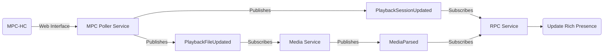

```mermaid

graph LR

    PlaybackSessionUpdated["PlaybackSessionUpdated"]
    PlaybackFileUpdated["PlaybackFileUpdated"]
    UpdateRichPresence("Update Rich Presence")
    MpcPollerService["MPC Poller Service"]
    MediaService["Media Service"]
    MediaParsed["MediaParsed"]
    RpcService["RPC Service"]
    MPCHC("MPC-HC")
    
    MPCHC -->|Web Interface| MpcPollerService
    
    MpcPollerService -->|Publishes| PlaybackFileUpdated
    
    MpcPollerService -->|Publishes| PlaybackSessionUpdated
    
    PlaybackFileUpdated -->|Subscribes| MediaService
    
    MediaService -->|Publishes| MediaParsed
    
    PlaybackSessionUpdated -->|Subscribes| RpcService
    
    MediaParsed -->|Subscribes| RpcService
    
    RpcService --> UpdateRichPresence
    
```
