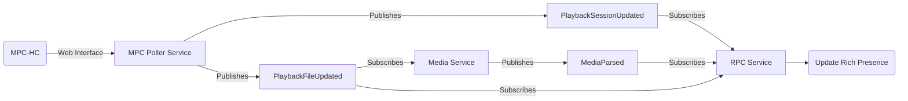

# Architecture

## Overview

## Components

### MPC Poller Service

Periodically polls MPC-HC's web interface (`/variables.html`) and detects three types of changes by comparing the current state with the previous one:

- **File changed** — the currently loaded file path changed, publishing a `PlaybackFileUpdated` event.
- **State changed** — the playback state (playing, paused, stopped) changed, publishing a `PlaybackSessionUpdated` event.
- **Seek** — the playback position changed outside of normal progression, also publishing a `PlaybackSessionUpdated` event.

### Media Service

Subscribes to `PlaybackFileUpdated`. When a new file is detected, it attempts to identify the media using an **adapter**. The adapter exposes one public method:

- `Fetch(MediaFile) -> QueryResult | None` — Returns media metadata for the given MediaFile.

Fetch is wrapped around two private methods:

- `__Search(MediaFile) -> SearchResult` — identifies the media type and ID and returns a SearchResult object.
- `__Query(MediaFile, SearchResult) -> QueryResult` — fetches metadata (title, director/episode info, poster, year) for the SearchResult.

On success, the service constructs a `Movie` or `Series` object and publishes a `MediaParsed` event.

### RPC Service

Manages Discord Rich Presence. It subscribes to three events:

- **`MediaParsed`** — updates the Rich Presence with the recognized media's metadata.
- **`PlaybackSessionUpdated`** — updates the Rich Presence to reflect the current playback state (playing/paused) and elapsed time.
- **`PlaybackFileUpdated`** — resets the Rich Presence. This handles the edge case where the user switches from a recognized media to an unrecognized one: since `MediaParsed` won't fire for the new file, the reset on `PlaybackFileUpdated` ensures the previous presence doesn't remain stale while waiting for a session update.

## Events

| Event | Published by | Payload |
|---|---|---|
| `PlaybackFileUpdated` | MPC Poller Service | `PlaybackFile` (current filename) |
| `PlaybackSessionUpdated` | MPC Poller Service | `PlaybackSession` (state, position, duration) |
| `MediaParsed` | Media Service | `Movie` or `Series` |

## Data Models

**Playback** — `PlaybackFile` holds the current filename; `PlaybackSession` holds the playback state, position, and duration. `PlaybackState` is an enum with `PLAYING`, `PAUSED`, and `EMPTY`.

**Media** — `Movie` holds title, director, year, and poster URL. `Series` holds title, season, episode, and poster URL.

**Adapter** — `SearchResult` holds the media type and ID returned by a search operation. `QueryResult` holds the title, director, poster URL, and year returned by a query operation.
